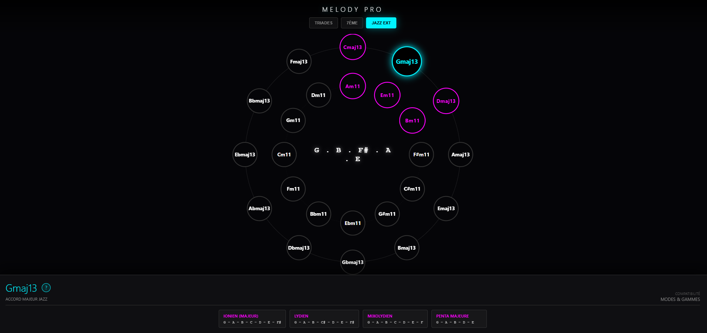

🎵 MELODY PRO

**L'explorateur harmonique interactif pour musiciens et compositeurs.**

👉 **[Accéder à l'application en direct](https://melody-pro.binokub.com)**

---

## ✨ Fonctionnalités
* **Nexus Harmonique** : Navigation visuelle dans le cycle des quintes.
* **Théorie Jazz** : Support des accords de 7ème, 9ème, 11ème et 13ème.
* **Modes & Gammes** : Affichage dynamique des modes grecs pour chaque accord.
* **Installation PWA** : Utilisez Melody Pro comme une application native sur iOS et Android [cite: 2026-01-09].

## 🛠️ Installation pour les développeurs
1. Clonez le dépôt : `git clone https://github.com/BINOKUB/MELODY-PRO.git`.
2. Ouvrez `index.html` dans votre navigateur préféré.
3. Aucune dépendance externe n'est requise (Vanille JS/HTML/CSS).

## 📄 Licence
Ce projet est sous licence MIT - voir le fichier [LICENSE](LICENSE) pour plus de détails.

## ✍️ Crédits & Auteur

Ce projet est une création originale de **BINOKUB**.

* **Site Officiel & Blog** : [www.binokub.com](https://www.binokub.com)
* **Concept** : Système de gestion musicale et exploration harmonique théorique.

* 

  
  > **Le Nexus Harmonique en action** : Cette interface interactive utilise le cycle des quintes pour vous permettre de naviguer entre les tonalités. En un clic, vous visualisez les triades, les accords de 7ème et les extensions Jazz (11e, 13e), tout en identifiant instantanément les modes et gammes compatibles.

